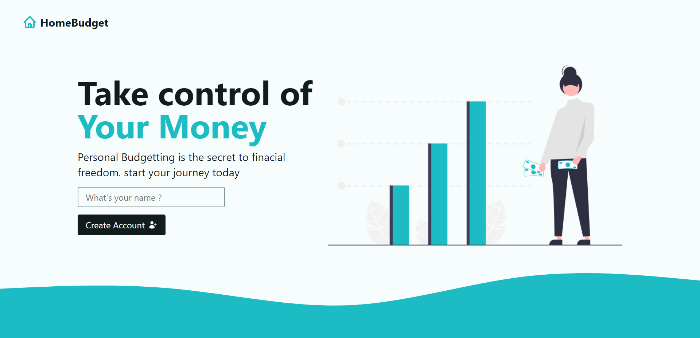
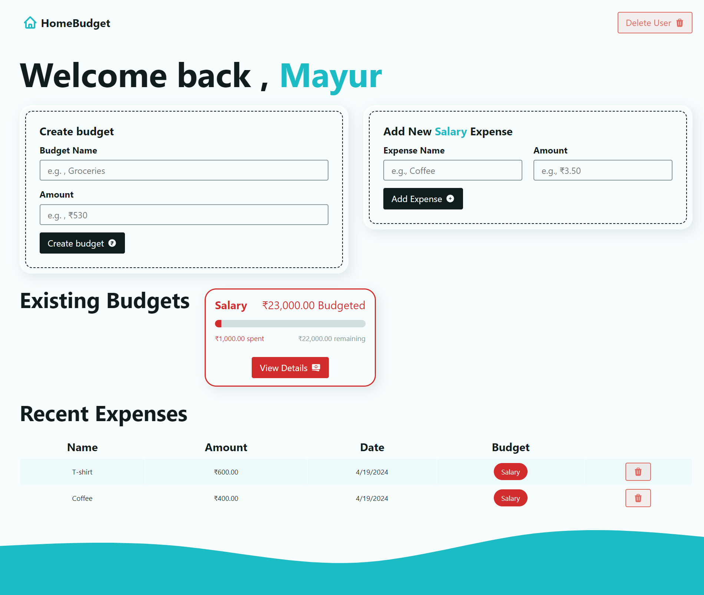

# Budget Manager App

A React JS budget app is a powerful tool for managing personal finances efficiently. Leveraging the capabilities of React, this app offers a dynamic and interactive user interface, allowing users to seamlessly track their expenses, monitor their incomes.React JS budget app empowers users to take control of their finances with ease and clarity.

## Features and Usage

Once you have set up the project locally, you can interact with the React Budget App can transform the way you manage your finances.

### 1. Home Page



Visit the Home page to create your account and manage your finances.

### 2. Dashboard Page



**Create Your Budget**

Upon entering the dashboard, you'll have the option to create your budget. Simply input your budget name and income, allocate funds to different expense categories.

**Add Expenses to Your Budget**

Once your budget is set up, you can easily add expenses to track your spending against your allocated budget. With a simple interface, you can select the budget category, enter the amount spent, and provide a brief description of the expense. The app automatically deducts the expense from the corresponding category in your budget, keeping you informed about your remaining funds.

**Delete Your Expense in the Budget**

If you've made a mistake or need to adjust your expenses, the dashboard allows you to delete or edit individual expenses. Simply locate the expense you wish to remove, and with a click of a delete button, the app updates your budget accordingly, restoring the allocated funds to their original categories.

### 3. Responsive Design

Test the responsiveness of the website by accessing it from different devices - desktops, tablets, and mobile phones. Ensure that the user interface adapts gracefully to various screen sizes.

### 4. Testing

Feel free to test any additional features, report any issues you encounter, and contribute to the improvement of the project.

## Getting Started

Follow these steps to set up and run the [Budget App]() Website on your local machine.

### Installation

1. Clone the repository to your local machine:

   ```bash
   git clone https://github.com/mkkapadi12/budget-app.git
   ```

2. Change your working directory to the project folder:

   ```bash
   cd budget-app
   ```

3. Install the required dependencies:

```bash
npm install
```

### Running the App

1. Start the development server:

   ```bash
   npm run dev
   ```

2. Open your web browser and navigate to [http://localhost:3000](http://localhost:3000) to access the Budget App.

## Contributing

Contributions and improvements are welcome! If you have any ideas, feature suggestions, or bug reports, please open an issue or create a pull request on the [Mayur Budget App GitHub repository](https://github.com/mkkapadi12/budget-app).

## License

This project is licensed under the MIT License. See the [LICENSE.md](LICENSE.md) file for details.

## Acknowledgments

- Built with [React.js](https://reactjs.org).

## Contact

If you have any questions or need assistance, please feel free to contact us at

- Email: [mayurkapadi12@gmail.com]
- GitHub: [https://github.com/mkkapadi12]

Enjoy and Manage your Budget with the [Mayur Budget App](#) !
